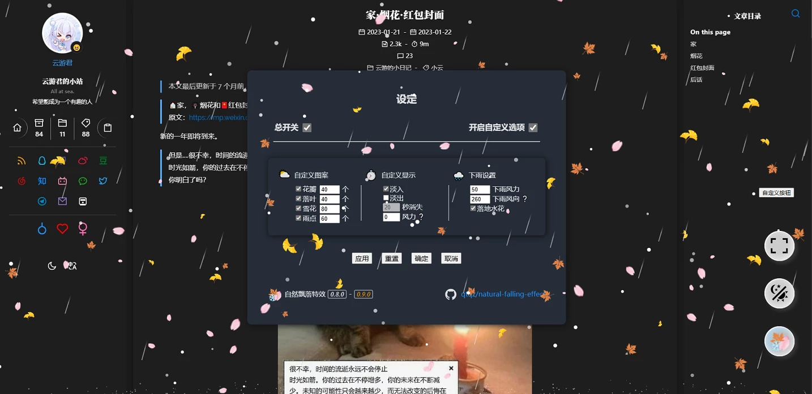

# 自然飘落特效

## 介绍

这是一个让你的页面可以**飘落花瓣树叶、下雨下雪**的特效库，支持自定义配置。支持以 **js 模块**或 **vue 组件**形式使用。使用 js 绘制 canvas 实现。

This is a special effects library that allows your page to float petals and leaves, rain and snow, and supports custom configuration. Support the use of **js modules** or **Vue components**.It is implemented using JavaScript to draw canvas.

核心 js 功能：

* ✨漂亮的效果
* 📦整合 4 种特效：落花🌸，落叶🍂，下雨🌧️，下雪❄️
* ⚙️丰富的可配置项
* ⌛支持淡入淡出，定时关闭
* ⚡性能较好

Vue 组件额外功能：

* 🛠️访客可以自定义配置
* 👶支持简单模式/自定义入口按钮
* 📱GUI 适配暗黑模式、移动端

## 预览



也可以访问演示页面：[https://qtqz.github.io/natural-falling-effect/](https://qtqz.github.io/natural-falling-effect/)。

代码经过多次优化，目前性能已经比许多同类项目要好。并且在高刷新率设备上也可以正常运行。

## 使用

### 核心 js

直接使用：

```html
<!-- 自行托管 -->
<script type="module">
    import { fallingCreate, version, defaultConfig } from './naturalfalling.js'
    fallingCreate()
</script>
```

> 如需预览，因为使用了`type="module"`，你需要从本地 web 服务器`http-serve`打开预览，不能从文件夹打开。

或是在项目中安装：

```bash
pnpm i natural-falling-js
# 或者使用其他包管理器 npm i natural-falling-js
```

然后引入：`import { fallingCreate, version, defaultConfig } from 'natural-falling-js'`

调用说明与示例：

* `let f = fallingCreate(/*配置对象*/)`传入一个配置对象（可以只传想修改的属性），不传则用默认配置。它将返回它的结束接口。
* `f.destroy()`调用上一条语句返回的结束接口，可以立即结束特效。
* `version`为当前 js 版本号。
* `defaultConfig`默认配置。

```vue
<script lang="ts" setup>
import { ref, onMounted, onUnmounted } from 'vue'
// @ts-ignore
import { fallingCreate } from 'natural-falling-js'

const cfg = {
  open: true,
  imgNumSetting: [10, 10, 50, 20],
  fadeOut: true,
  fadeOut_time: 20
}
let openFall = true,
  f = ref()

onMounted(() => {
  openFall ? f.value = fallingCreate(cfg) : 0
})

onUnmounted(() => {
  openFall ? f.value.destory() : 0
})
</script>
```

详细配置和默认的配置说明：

```js
{
    open: true,// 总开关
    imgSetting: [],// 图案，有['petal','leaf','snow','rain']，不填将自动选择
    imgNumSetting: [40, 40, 80, 60],// 对应上面，每个图案的数量
    fadeIn: true,// 淡入，会从上往下落，而非一开始就满屏都是
    fadeOut: false,// 淡出，否则会一直飘
    fadeOut_time: 20,// 淡出时间，几秒后开始逐渐消失
    rain_speed: 50,// 下雨风力
    rain_deviation: 4,// 下雨横向风力误差，越大越散
    rain_angle: 260,// 下雨风向，从+x方向逆时针角度，270为垂直向下
    rain_hasBounce: true,// 是否落地溅水花
    gravity: 0.163,// 重力，影响所有下落速度
    zIndex: 100,// canvas的css z-index，修改可以实现不遮挡网页正文
    imgSize: [40, 40, 2.5],// 图案大小（花瓣，树叶，天雪），雨滴宽度固定为2，长度跟风力有关
    wind_x: 0// -70// 花瓣，树叶，天雪飘落的横向风力，默认为0（无方向微风），填-70且关闭淡入时，效果与文末参考链接效果相似
}
```

注意图案如果不填，将**根据季节自动选择**（北方体感季节，春分至夏至为春，飘落花瓣，以此类推，有一两天误差）。

如果你的页面内容较多，又想使用特效，为**避免干扰阅读**，可勾选**淡出**，这样度过你设置的秒数后，就会停止飘落特效。

### vue 组件

```bash
pnpm i vue-natural-falling
# 如果没有pnpm：npm i vue-natural-falling
```

然后引入：`import VueNaturalFalling from 'vue-natural-falling'`

```vue
  <VueNaturalFalling :masterConfig="naturalFallingConfig" :buttonClass="''" :easyMode="false" />
```

* `masterConfig: object` 配置，不传则用默认配置，详见[上一节](#核心 js)。
* `buttonClass: string` 自定义入口按钮，传入按钮的 CSS 类名，允许你将默认按钮换成自己的，有助于页面风格一致。组件挂载时其必须存在于 DOM 树中。
* `easyMode: boolean` 简单模式，默认关闭，传入`true`启用，会将入口按钮的用途从**开关界面**改为**开关特效**。

另外，将此组件置于`dark`类名下，即可启用暗色模式。

## 支持我

💰 [赞赏码](https://qtqz.github.io/img/sponsor.png)

## 更新日志

1. 2023.8 启动，整合多个项目，初步可用，后搁置
2. 2024.1 重启，重构代码，完善功能，发布核心 js
3. 2024.3 发布 vue 组件，优化小屏幕显示
4. 2025.1 **彻底重构**，优化性能，简化使用

- vue 0.6.4：更新后重置访客配置
- vue 0.7.0：适配移动端
- vue 0.7.1：修复重置访客配置
- js 0.8.0：优化小屏幕显示，整理越来越乱的代码 :（
- js 0.8.1：更好地判断季节（大致根据节气区间）
- js 0.9.0：彻底重构
- vue 0.8.0：大幅简化和完善

## 许可证与参考

此项目许可证为MIT License，署名或注明出处后放心使用。参考的项目：

* 花瓣//https://github.com/tangly1024/NotionNext/blob/main/components/Sakura.js
* 花瓣来源2//https://qiu-weidong.github.io/2022/04/30/blog/sakura/
* 橘黄枫叶//https://github.com/lw308069077/maple-leaf
* 银杏树叶//https://github.com/BlackCatCj/Defoliation-animation
* 下雨//https://github.com/brownliu/rain.js
* 下雪的效果//https://nextapps.de/snowflake/
* 花瓣的效果2//